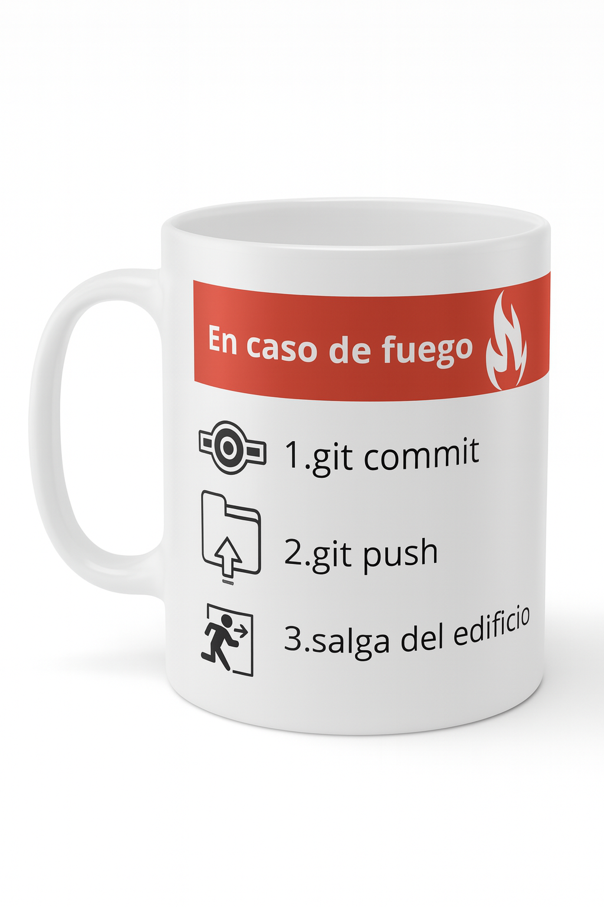

# 📚 Guía de Aprendizaje - E-commerce Frontend (Módulo 2)

## 🎯 Índice
1. [Estructura del Proyecto](#estructura-del-proyecto)
2. [HTML5 Semántico](#html5-semántico)
3. [Bootstrap Framework](#bootstrap-framework)
4. [JavaScript y DOM](#javascript-y-dom)
5. [CSS Personalizado](#css-personalizado)
6. [Git y GitHub](#git-y-github)

---

## 📁 Estructura del Proyecto

```
ecommerce-frontend-m2/
├── index.html          # Página principal (Home) - Catálogo de productos
├── product.html        # Página de detalle de producto
├── cart.html           # Página del carrito de compras
├── css/
│   └── styles.css      # Estilos personalizados
├── js/
│   └── app.js          # Lógica de la aplicación (JavaScript)
├── img/                # Imágenes de productos
│   ├── taza.png
│   ├── polera404.png
│   └── stickers.png
├── README.md           # Documentación del proyecto
└── .gitignore          # Archivos ignorados por Git
```

**¿Por qué esta estructura?**
- **Separación de responsabilidades**: HTML (estructura), CSS (presentación), JS (comportamiento)
- **Organización clara**: Facilita el mantenimiento y escalabilidad
- **Convenciones web**: Estructura estándar reconocida en la industria

---

## 🏗️ HTML5 Semántico

### ¿Qué es HTML5 Semántico?

HTML5 semántico usa **etiquetas que describen su contenido**, no solo su apariencia.

#### ❌ HTML No Semántico (mal):
```html
<div class="header">
  <div class="nav">...</div>
</div>
```

#### ✅ HTML Semántico (bien):
```html
<header>
  <nav>...</nav>
</header>
```

### Etiquetas Semánticas Usadas en el Proyecto

#### 1. `<header>` - Encabezado de la página
```html
<header>
  <nav class="navbar">...</nav>
</header>
```
**Propósito**: Contiene el navbar con la navegación principal.

---

#### 2. `<nav>` - Navegación
```html
<nav class="navbar navbar-expand-lg navbar-dark bg-dark">
  <ul class="navbar-nav">
    <li class="nav-item"><a href="index.html">Inicio</a></li>
    <li class="nav-item"><a href="cart.html">Carrito</a></li>
  </ul>
</nav>
```
**Propósito**: Define un bloque de navegación con enlaces.

---

#### 3. `<main>` - Contenido principal
```html
<main class="container mt-4">
  <section id="catalog">...</section>
</main>
```
**Propósito**: Contiene el contenido principal único de la página.
**Regla**: Solo debe haber UN `<main>` por página.

---

#### 4. `<section>` - Sección temática
```html
<section id="catalog">
  <h1 class="mb-4">Productos</h1>
  <div id="product-list" class="row"></div>
</section>
```
**Propósito**: Agrupa contenido relacionado temáticamente.

---

#### 5. `<article>` - Contenido independiente
```html
<article id="product-detail" class="row justify-content-center">
  <!-- Detalle del producto -->
</article>
```
**Propósito**: Representa contenido que podría distribuirse independientemente.

---

#### 6. `<footer>` - Pie de página
```html
<footer class="bg-dark text-white text-center p-3 mt-4">
  <p>Geek Store © 2025 - Tienda ficticia</p>
</footer>
```
**Propósito**: Información al final del documento.

---

## 🎨 Bootstrap Framework

### ¿Qué es Bootstrap?

Bootstrap es un **framework CSS** que proporciona:
- Sistema de grillas (grid system) responsive
- Componentes prediseñados (navbar, cards, buttons)
- Utilidades CSS (espaciados, colores, tipografía)

### Inclusión de Bootstrap

```html
<!-- CSS de Bootstrap -->
<link href="https://cdn.jsdelivr.net/npm/bootstrap@5.3.2/dist/css/bootstrap.min.css" rel="stylesheet">

<!-- JS de Bootstrap (necesario para componentes interactivos) -->
<script src="https://cdn.jsdelivr.net/npm/bootstrap@5.3.2/dist/js/bootstrap.bundle.min.js"></script>
```

**CDN (Content Delivery Network)**: Servidor que aloja librerías para acceso rápido.

---

### Grid System (Sistema de Grillas)

Bootstrap divide el ancho de la página en **12 columnas**.

```html
<div class="container">          <!-- Contenedor con márgenes -->
  <div class="row">               <!-- Fila -->
    <div class="col-md-4">        <!-- Columna de 4/12 en dispositivos medianos -->
      <!-- Card de producto -->
    </div>
    <div class="col-md-4">        <!-- Otra columna de 4/12 -->
      <!-- Card de producto -->
    </div>
    <div class="col-md-4">        <!-- Otra columna de 4/12 -->
      <!-- Card de producto -->
    </div>
  </div>
</div>
```

**Resultado**: 3 columnas de igual ancho (4+4+4 = 12).

#### Breakpoints (Puntos de quiebre):
- `col-`: Extra small (< 576px) - Móvil
- `col-sm-`: Small (≥ 576px)
- `col-md-`: Medium (≥ 768px) - Tablet
- `col-lg-`: Large (≥ 992px) - Desktop
- `col-xl-`: Extra large (≥ 1200px)

**Ejemplo en el proyecto**:
```html
<div class="col-md-4 mb-4">
```
- En **desktop** (≥768px): ocupa 4/12 (33.33%)
- En **móvil** (< 768px): ocupa 12/12 (100%) - apiladas verticalmente

---

### Componentes de Bootstrap

#### 1. Navbar (Barra de navegación)

```html
<nav class="navbar navbar-expand-lg navbar-dark bg-dark">
  <div class="container-fluid">
    <a class="navbar-brand" href="index.html">Geek Store</a>
    
    <!-- Botón hamburguesa (solo visible en móvil) -->
    <button class="navbar-toggler" type="button" 
            data-bs-toggle="collapse" 
            data-bs-target="#navbarNav">
      <span class="navbar-toggler-icon"></span>
    </button>
    
    <!-- Menú colapsable -->
    <div class="collapse navbar-collapse" id="navbarNav">
      <ul class="navbar-nav ms-auto">
        <li class="nav-item">
          <a class="nav-link active" href="index.html">Inicio</a>
        </li>
        <li class="nav-item">
          <a class="nav-link" href="cart.html">
            <i class="bi bi-cart3"></i> Carrito 
            <span id="cart-count" class="badge bg-warning">0</span>
          </a>
        </li>
      </ul>
    </div>
  </div>
</nav>
```

**Clases explicadas**:
- `navbar`: Componente navbar base
- `navbar-expand-lg`: Se expande en pantallas grandes, colapsa en pequeñas
- `navbar-dark`: Texto blanco (para fondos oscuros)
- `bg-dark`: Fondo oscuro
- `navbar-toggler`: Botón hamburguesa para móviles
- `collapse navbar-collapse`: Contenido que se colapsa
- `ms-auto`: Margin start auto (empuja el menú a la derecha)
- `nav-link active`: Link activo (página actual)

---

#### 2. Card (Tarjeta de producto)

```html
<div class="card h-100">
  <a href="product.html?id=1">
    
  </a>
  <div class="card-body d-flex flex-column">
    <h5 class="card-title">Taza Geek</h5>
    <p class="card-text fw-bold text-success">$5.000</p>
    <div class="mt-auto d-grid gap-2">
      <a href="product.html?id=1" class="btn btn-outline-secondary">Ver más</a>
      <button class="btn btn-primary" onclick="addToCart(1)">Agregar al carrito</button>
    </div>
  </div>
</div>
```

**Clases explicadas**:
- `card`: Componente tarjeta
- `h-100`: Height 100% (altura completa para alinear todas las cards)
- `card-img-top`: Imagen en la parte superior
- `card-body`: Cuerpo de la tarjeta
- `d-flex flex-column`: Display flex en columna (vertical)
- `card-title`: Título de la tarjeta
- `card-text`: Texto de la tarjeta
- `fw-bold`: Font weight bold (negrita)
- `text-success`: Color verde (Bootstrap)
- `mt-auto`: Margin top auto (empuja contenido al final)
- `d-grid gap-2`: Grid display con espacio de 2

---

#### 3. Buttons (Botones)

```html
<button class="btn btn-primary">Agregar al carrito</button>
<a href="index.html" class="btn btn-outline-secondary">Volver</a>
```

**Variantes de botones**:
- `btn-primary`: Azul (acción principal)
- `btn-secondary`: Gris (acción secundaria)
- `btn-outline-secondary`: Borde gris, fondo transparente
- `btn-success`: Verde (éxito)
- `btn-danger`: Rojo (peligro/eliminar)
- `btn-lg`: Botón grande
- `btn-sm`: Botón pequeño

---

#### 4. Badge (Insignia)

```html
<span id="cart-count" class="badge bg-warning">0</span>
```

**Propósito**: Mostrar el contador de productos en el carrito.
- `badge`: Componente insignia
- `bg-warning`: Fondo amarillo/naranja

---

### Utilidades de Bootstrap

#### Espaciado (Spacing)

Bootstrap usa un sistema de espaciado de 0 a 5:

```html
<div class="mt-4">    <!-- Margin top: 1.5rem -->
<div class="mb-3">    <!-- Margin bottom: 1rem -->
<div class="p-3">     <!-- Padding: 1rem -->
<div class="ms-auto"> <!-- Margin start (left): auto -->
```

**Sintaxis**: `{propiedad}{lado}-{tamaño}`
- Propiedades: `m` (margin), `p` (padding)
- Lados: `t` (top), `b` (bottom), `s` (start/left), `e` (end/right), `x` (horizontal), `y` (vertical)
- Tamaños: `0`, `1`, `2`, `3`, `4`, `5`, `auto`

---

#### Display y Flexbox

```html
<div class="d-flex justify-content-between align-items-center">
  <!-- Contenido distribuido con espacio entre elementos -->
</div>

<div class="d-grid gap-2">
  <!-- Botones apilados con espacio de 2 -->
</div>
```

**Clases comunes**:
- `d-flex`: Display flex
- `d-grid`: Display grid
- `justify-content-between`: Espacio entre elementos
- `align-items-center`: Alinear al centro verticalmente
- `flex-column`: Dirección de flex en columna
- `gap-2`: Espacio entre elementos del grid

---

#### Texto y Tipografía

```html
<h1 class="mb-4">Productos</h1>
<p class="text-center">Texto centrado</p>
<p class="fw-bold">Texto en negrita</p>
<p class="text-success">Texto verde</p>
<small class="text-muted">Texto pequeño y gris</small>
```

---

## 💻 JavaScript y DOM

### ¿Qué es el DOM?

**DOM (Document Object Model)** es la representación en memoria del HTML como un árbol de objetos que JavaScript puede manipular.

```
document
  └── html
      ├── head
      │   ├── title
      │   └── link (CSS)
      └── body
          ├── header
          │   └── nav
          ├── main
          │   └── section
          └── footer
```

---

### Selección de elementos del DOM

#### 1. `getElementById()`
```javascript
const list = document.getElementById("product-list");
```
**Propósito**: Seleccionar un elemento por su ID.
**Retorna**: Un solo elemento (o `null` si no existe).

#### 2. `querySelector()`
```javascript
const count = document.querySelector("#cart-count");
```
**Propósito**: Seleccionar el primer elemento que coincida con un selector CSS.

#### 3. `querySelectorAll()`
```javascript
const buttons = document.querySelectorAll(".btn-primary");
```
**Propósito**: Seleccionar TODOS los elementos que coincidan.
**Retorna**: Una NodeList (similar a un array).

---

### Manipulación del DOM

#### 1. Modificar contenido HTML
```javascript
list.innerHTML = `<div class="card">...</div>`;
```
**innerHTML**: Reemplaza todo el contenido HTML interno.

#### 2. Modificar texto
```javascript
count.textContent = cart.length;
```
**textContent**: Cambia solo el texto, sin HTML.

#### 3. Crear elementos dinámicamente
```javascript
const alert = document.createElement('div');
alert.className = 'alert alert-success';
alert.innerHTML = '<strong>¡Agregado!</strong>';
document.body.appendChild(alert);
```

---

### Arrays y Objetos en JavaScript

#### Array de productos
```javascript
const products = [
  {
    id: 1,
    name: "Taza Geek",
    price: 5000,
    img: "img/taza.png"
  },
  {
    id: 2,
    name: "Polera 404",
    price: 12000,
    img: "img/polera404.png"
  }
];
```

**¿Qué es?**
- `const products`: Variable constante (no se puede reasignar)
- `[...]`: Array (lista ordenada)
- `{...}`: Objeto (conjunto de propiedades clave-valor)

---

### Métodos de Arrays

#### 1. `map()` - Transformar array
```javascript
products.map(p => `
  <div class="card">
    <h5>${p.name}</h5>
    <p>$${p.price}</p>
  </div>
`)
```
**Propósito**: Recorre el array y transforma cada elemento.
**Retorna**: Un nuevo array con los elementos transformados.

**Ejemplo paso a paso**:
```javascript
// Entrada:
[
  {id: 1, name: "Taza", price: 5000},
  {id: 2, name: "Polera", price: 12000}
]

// Salida después de map:
[
  "<div class='card'><h5>Taza</h5><p>$5000</p></div>",
  "<div class='card'><h5>Polera</h5><p>$12000</p></div>"
]
```

---

#### 2. `join()` - Unir array en string
```javascript
.join("")
```
**Propósito**: Convierte un array en un string, uniendo elementos.
**Ejemplo**:
```javascript
["A", "B", "C"].join("") // "ABC"
["A", "B", "C"].join("-") // "A-B-C"
```

---

#### 3. `find()` - Buscar elemento
```javascript
const product = products.find(p => p.id === productId);
```
**Propósito**: Encuentra el primer elemento que cumpla la condición.
**Retorna**: El objeto encontrado (o `undefined`).

**Ejemplo**:
```javascript
const products = [
  {id: 1, name: "Taza"},
  {id: 2, name: "Polera"}
];

const found = products.find(p => p.id === 2);
// Resultado: {id: 2, name: "Polera"}
```

---

#### 4. `filter()` - Filtrar array
```javascript
cart = cart.filter(item => item.id !== id);
```
**Propósito**: Crea un nuevo array con elementos que cumplan la condición.

**Ejemplo**:
```javascript
const cart = [
  {id: 1, name: "Taza"},
  {id: 2, name: "Polera"},
  {id: 3, name: "Stickers"}
];

// Eliminar producto con id 2
const newCart = cart.filter(item => item.id !== 2);
// Resultado: [{id: 1, name: "Taza"}, {id: 3, name: "Stickers"}]
```

---

#### 5. `reduce()` - Reducir array a un valor
```javascript
const total = cart.reduce((sum, item) => sum + (item.price * item.quantity), 0);
```
**Propósito**: Reduce el array a un único valor (suma, concatenación, etc.).

**Ejemplo paso a paso**:
```javascript
const cart = [
  {price: 5000, quantity: 2},   // 10.000
  {price: 12000, quantity: 1},  // 12.000
  {price: 2000, quantity: 3}    // 6.000
];

// Iteración 1: sum=0, item={price:5000, quantity:2}  → 0 + 10000 = 10000
// Iteración 2: sum=10000, item={price:12000, quantity:1} → 10000 + 12000 = 22000
// Iteración 3: sum=22000, item={price:2000, quantity:3}  → 22000 + 6000 = 28000
// Resultado: 28000
```

---

### Eventos en JavaScript

#### 1. Eventos inline (en HTML)
```html
<button onclick="addToCart(1)">Agregar</button>
```
**Ventaja**: Simple y directo.
**Desventaja**: Mezcla HTML con JavaScript.

---

#### 2. Event Listener (JavaScript puro)
```javascript
button.addEventListener('click', function() {
  addToCart(1);
});
```
**Ventaja**: Separación de responsabilidades.

---

#### 3. DOMContentLoaded
```javascript
document.addEventListener("DOMContentLoaded", () => {
  renderProducts();
  updateCartCount();
});
```
**Propósito**: Ejecutar código cuando el DOM esté completamente cargado.
**¿Por qué?**: Asegura que los elementos HTML existan antes de manipularlos.

---

### LocalStorage (Almacenamiento local)

#### ¿Qué es localStorage?

Almacenamiento en el navegador que **persiste** incluso después de cerrar la página.

```javascript
// GUARDAR en localStorage
localStorage.setItem("cart", JSON.stringify(cart));

// LEER de localStorage
const savedCart = localStorage.getItem("cart");
const cart = JSON.parse(savedCart) || [];
```

**Métodos**:
- `setItem(key, value)`: Guardar datos
- `getItem(key)`: Leer datos
- `removeItem(key)`: Eliminar datos
- `clear()`: Limpiar todo

**Importante**: localStorage solo guarda **strings**, por eso usamos:
- `JSON.stringify()`: Convierte objeto → string
- `JSON.parse()`: Convierte string → objeto

**Ejemplo**:
```javascript
const cart = [{id: 1, name: "Taza"}];

// Guardar
localStorage.setItem("cart", JSON.stringify(cart));
// Se guarda como: '[{"id":1,"name":"Taza"}]'

// Recuperar
const savedCart = localStorage.getItem("cart");
// savedCart es un string: '[{"id":1,"name":"Taza"}]'

const cart = JSON.parse(savedCart);
// cart es un array: [{id: 1, name: "Taza"}]
```

---

### Operador OR lógico (`||`)

```javascript
let cart = JSON.parse(localStorage.getItem("cart")) || [];
```

**Significado**: "Si la izquierda es `null`/`undefined`/`false`, usa la derecha".

**Ejemplo**:
```javascript
// Si NO hay carrito en localStorage:
JSON.parse(null) // → null
null || []       // → []

// Si SÍ hay carrito:
JSON.parse('[{"id":1}]') // → [{id:1}]
[{id:1}] || []           // → [{id:1}]
```

---

### Template Literals (Plantillas literales)

```javascript
const name = "Taza";
const price = 5000;

// Forma antigua:
const html = '<h5>' + name + '</h5><p>$' + price + '</p>';

// Forma moderna (template literal):
const html = `
  <h5>${name}</h5>
  <p>$${price}</p>
`;
```

**Características**:
- Se usan **backticks** (`` ` ``) en lugar de comillas
- Permiten **interpolación** con `${variable}`
- Permiten **múltiples líneas**

---

### Arrow Functions (Funciones flecha)

```javascript
// Forma tradicional:
function addToCart(id) {
  // código
}

// Arrow function:
const addToCart = (id) => {
  // código
};

// Arrow function en un parámetro (sin paréntesis):
products.map(p => `<div>${p.name}</div>`)

// Arrow function en una línea (return implícito):
const double = x => x * 2;
```

**Ventaja**: Sintaxis más corta y limpia.

---

### Spread Operator (`...`)

```javascript
cart.push({ ...product, quantity: 1 });
```

**Propósito**: Copiar todas las propiedades de un objeto.

**Ejemplo**:
```javascript
const product = {
  id: 1,
  name: "Taza",
  price: 5000
};

const cartItem = { ...product, quantity: 1 };
// Resultado:
// {
//   id: 1,
//   name: "Taza",
//   price: 5000,
//   quantity: 1
// }
```

**¿Por qué?**: Evita modificar el objeto original.

---

### URLSearchParams (Parámetros de URL)

```javascript
// URL: product.html?id=2
const params = new URLSearchParams(window.location.search);
const productId = parseInt(params.get("id"));
// productId = 2
```

**Propósito**: Leer parámetros de la URL.

**Componentes de una URL**:
```
https://example.com/product.html?id=2&color=blue
                    ^^^^^^^^^^^^  ^^^^^^^^^^^^^^^
                    pathname      search (query string)
```

---

## 🎨 CSS Personalizado

### Selectores CSS

```css
/* Selector de clase */
.card {
  transition: transform 0.2s ease-in-out;
}

/* Selector de ID */
#cart-count {
  font-size: 0.8rem;
}

/* Selector de etiqueta */
body {
  background-color: #f8f9fa;
}

/* Pseudo-clase :hover */
.card:hover {
  transform: scale(1.03);
}
```

---

### Box Model (Modelo de caja)

Todo elemento HTML es una "caja" con:

```
┌─────────────────────────────────────┐
│           MARGIN (externo)          │
│  ┌───────────────────────────────┐  │
│  │     BORDER (borde)            │  │
│  │  ┌─────────────────────────┐  │  │
│  │  │  PADDING (interno)      │  │  │
│  │  │  ┌───────────────────┐  │  │  │
│  │  │  │   CONTENT         │  │  │  │
│  │  │  │   (contenido)     │  │  │  │
│  │  │  └───────────────────┘  │  │  │
│  │  └─────────────────────────┘  │  │
│  └───────────────────────────────┘  │
└─────────────────────────────────────┘
```

**Ejemplo en el proyecto**:
```css
.card-img-top {
  padding: 15px;        /* Espacio interno */
  height: 250px;        /* Altura del contenido */
  object-fit: contain;  /* Cómo se ajusta la imagen */
}
```

---

### Flexbox

```css
.card-body {
  display: flex;
  flex-direction: column;
  flex-grow: 1;
}

.mt-auto {
  margin-top: auto; /* Empuja al final del contenedor flex */
}
```

**Propiedades principales**:
- `display: flex`: Activa flexbox
- `flex-direction`: `row` (horizontal) o `column` (vertical)
- `justify-content`: Alineación en el eje principal
- `align-items`: Alineación en el eje cruzado
- `flex-grow`: Permite que el elemento crezca

---

### Transiciones y Animaciones

```css
.card {
  transition: transform 0.2s ease-in-out;
}

.card:hover {
  transform: scale(1.03);
}
```

**Explicación**:
- `transition`: Define qué propiedad animar y cuánto dura
- `transform: scale(1.03)`: Escala el elemento al 103%
- `ease-in-out`: Curva de animación (lenta al inicio y al final)

---

### Media Queries (Responsive Design)

```css
/* Estilos para móviles (≤ 420px) */
@media (max-width: 420px) {
  .card-title {
    font-size: 1rem;
  }
  
  .navbar-brand {
    font-size: 1rem;
  }
}
```

**Propósito**: Aplicar estilos solo en ciertos tamaños de pantalla.

---

## 🔧 Git y GitHub

### Comandos básicos de Git

```bash
# Inicializar repositorio
git init

# Ver estado de archivos
git status

# Agregar archivos al staging area
git add .                  # Agregar todos
git add index.html         # Agregar archivo específico

# Hacer commit
git commit -m "Mensaje descriptivo"

# Ver historial
git log --oneline

# Conectar con GitHub
git remote add origin https://github.com/usuario/repo.git

# Subir cambios
git push origin main
```

---

### Convenciones de commits

```bash
feat: nueva funcionalidad
fix: corrección de bug
docs: cambios en documentación
style: cambios de formato (no afectan lógica)
refactor: refactorización de código
```

**Ejemplo del proyecto**:
```bash
feat: estructura inicial del proyecto e-commerce con HTML, CSS y JavaScript básico
fix: corregir errores críticos y mejorar estructura HTML semántica
docs: agregar README completo con descripción del proyecto
```

---

## 🎓 Conceptos Clave para el Módulo

### 1. HTML5 Semántico
✅ Usar `<header>`, `<nav>`, `<main>`, `<section>`, `<article>`, `<footer>`
✅ Jerarquía clara de encabezados (`<h1>`, `<h2>`, etc.)
✅ Atributos `alt` en imágenes para accesibilidad

### 2. Bootstrap
✅ Grid system responsive (mobile-first)
✅ Componentes: navbar, card, button, badge
✅ Utilidades: spacing, display, flexbox

### 3. JavaScript
✅ Manipulación del DOM (`getElementById`, `innerHTML`)
✅ Eventos (`click`, `DOMContentLoaded`)
✅ Arrays y objetos
✅ localStorage para persistencia

### 4. Git/GitHub
✅ Control de versiones
✅ Commits descriptivos
✅ Repositorio público
✅ README completo

---

## 📝 Ejercicios de Práctica

### Ejercicio 1: Agregar un producto nuevo
1. Agrega un nuevo producto al array `products` en `app.js`
2. Incluye una imagen en la carpeta `img/`
3. Verifica que aparezca en el catálogo

### Ejercicio 2: Cambiar colores
1. En `styles.css`, cambia el color del botón "Agregar al carrito"
2. Prueba con: `background-color: #28a745;` (verde)

### Ejercicio 3: Modificar el footer
1. En `index.html`, agrega tu nombre al footer
2. Agrega un enlace a tus redes sociales

---

## 🚀 Próximos Pasos

1. **Validación de formularios**: Agregar página de contacto
2. **Filtros**: Filtrar productos por precio o categoría
3. **Backend**: Conectar con una API REST
4. **Base de datos**: Persistir productos en servidor

---

## 📚 Recursos Adicionales

- **Bootstrap**: https://getbootstrap.com/docs/5.3/
- **MDN Web Docs**: https://developer.mozilla.org/es/
- **JavaScript.info**: https://javascript.info/
- **Git**: https://git-scm.com/book/es/v2

---

**¡Sigue practicando y experimentando! 💪**
